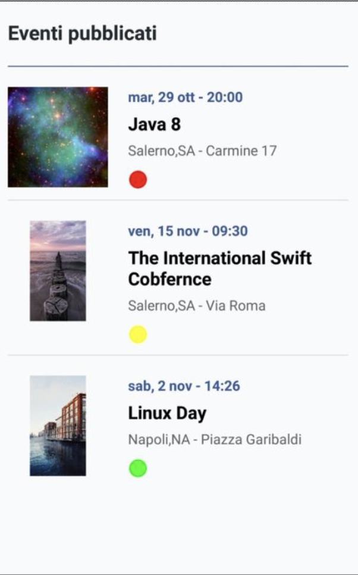
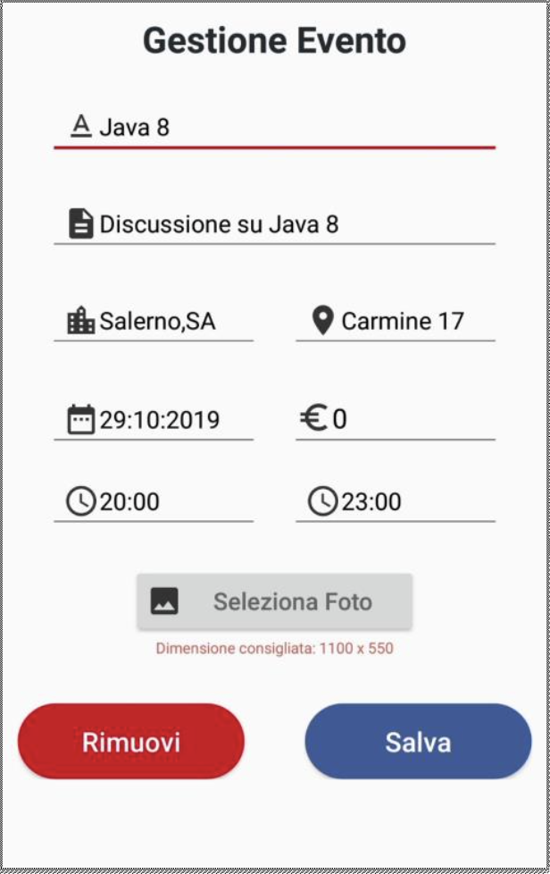
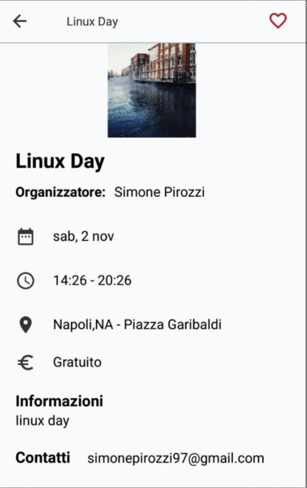
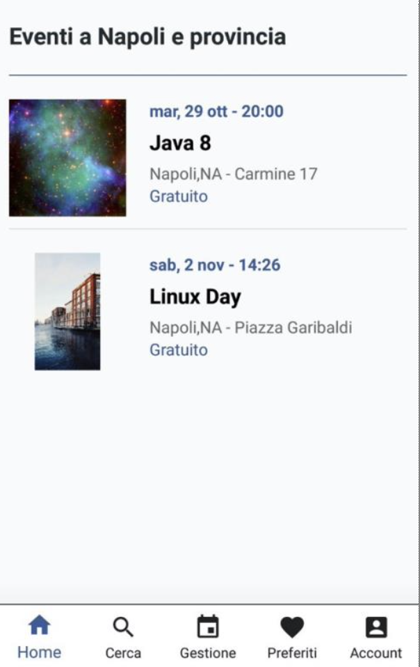

# Tech-Event
Android planner app in which you can publish and manage tech events.

 

  
  
    
  

#### This app has following packages:
1. **ui**: View classes along with their corresponding Presenter.
2. **data**: It contains all the data accessing and manipulating components.
3. **utils**: Utility classes.

#### This is a MVP Java Project
- I used Google Cloud Vision API to scan text in real-time
- I used Google Mobile Ads to show banner and interstitial
- I used Firebase Firestore to mantain all data.

 

  

